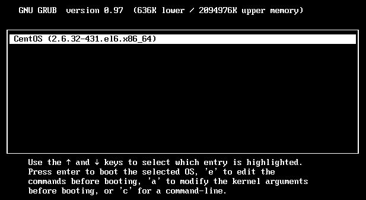
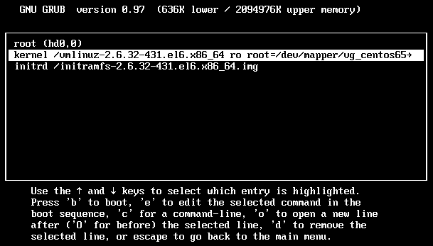
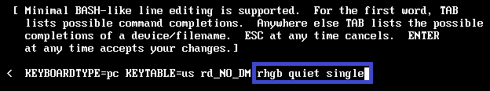
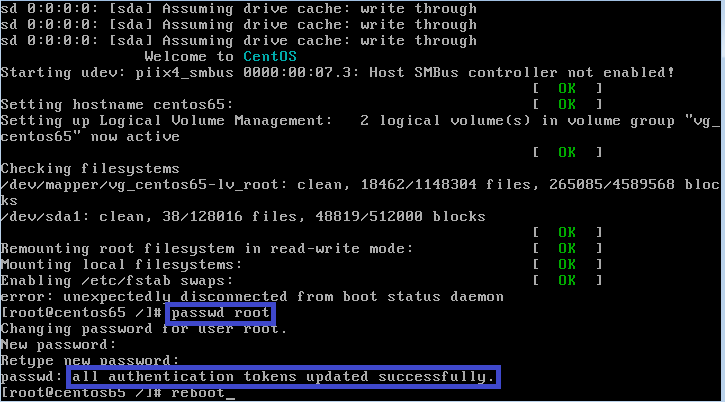

# 折腾Linux 过程中的一些记录
## Centos重置root密码
1. 启动界面出现下面画面时按任意键：

2. 在启动菜单选中系统，按“e”键继续：

3. 选中引导序列，继续按“e”编辑：

4. 将光标移至结尾，输入“single”并按回车键继续：

5. 在以下自动出现的界面中，按“b”键进行引导：

6. 出现命令提示符后，输入“passwd root”修改根用户密码，确认密码后修改成功，输入“reboot”重启系统即可完成重置

### :smile: 更加具体的内容请点击[链接](https://www.ytyzx.org/index.php/%E5%A6%82%E4%BD%95%E6%81%A2%E5%A4%8D%E6%88%96%E9%87%8D%E7%BD%AEFreeBSD_%26_Linux%E7%9A%84root%E5%AF%86%E7%A0%81)